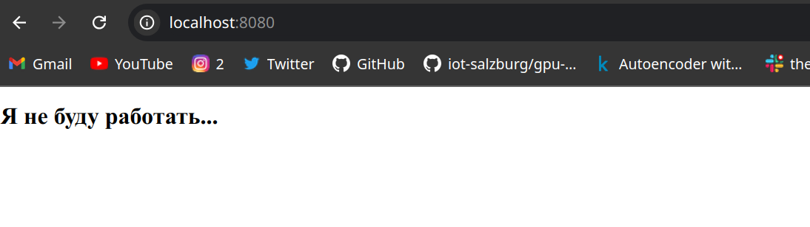

# 1st Lab - Docker and Nginx

## Steps

### 1. Create the `mynginx` Image
- Build a Docker image `mynginx` that runs Nginx inside the container.

### 2. Access Nginx via `http://localhost:8080`
- After building and running the container, access the Nginx response at `http://localhost:8080`.

### 3. Use Lightweight Alpine Image
- Use the `alpine:latest` image as a base for a lightweight container.

### 4. Enable External Nginx Configuration
- Configure Nginx through an external configuration file.

### 5. Use External Volume for Static Pages
- Store static pages (websites) as an external volume.

### 6. Run the Container as a Non-Privileged User
- Ensure the container runs as a non-privileged user.

### 7. Create a `docker-compose.yml` File
- Create a `docker-compose.yml` file to start and build the container.

